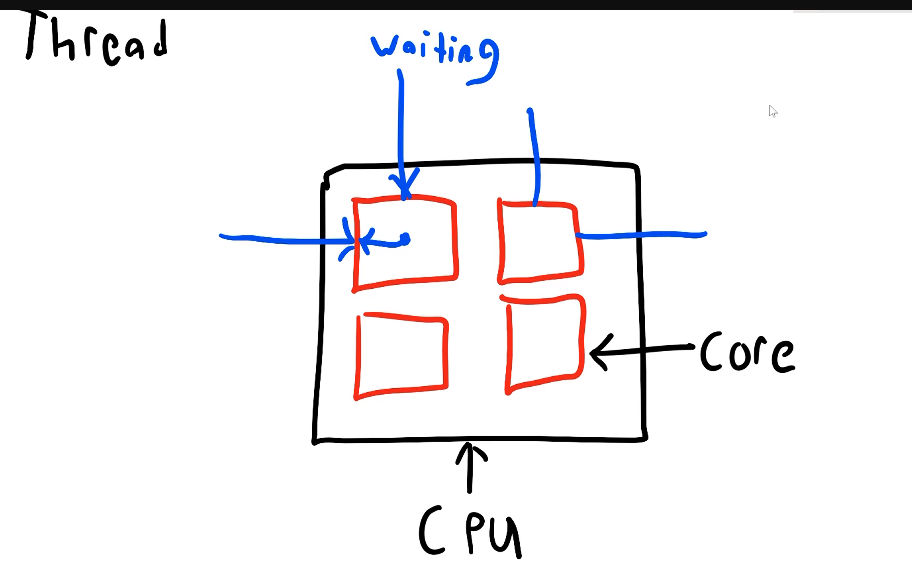

Intel Core i7-12700H processor has:

14 cores

Base speed is 2.30 GHz = 2.30 * 1e9 Hz = 2.3 Billion operations per second

This base speed is of a single core. 
2.3 GHz means that a single core can execute 2.3 billion operations per second

Every instruction given to a CPU takes some clock cycles.

In every clock cycle the CPU complete a microscopic piece of an instruction. Everytime the CPU clock ticks, it has an opportunity to do a tiny piece of work. So for a 2.3 GHz processor, it gets 2.3 billion opporunities to do some work per second. The performance of the CPU doen't solely depends upon it's clock rate. It also depends on IPC (Instructions per cycle) of the CPU (IPC is dynmic and also depends upon the actual code the CPU is executing, but every CPU has a theoretical maximum IPC it can achieve)

$$Performance = ClockRate \times IPC$$

For example, let's say adding two numbers takes 10 CPU cycles. I have two CPUs - CPU A has a clock rate of 2.3 GHz and an IPC of 1, while CPU B has a clock rate of 1.5 GHz and an IPC of 2.

For CPU A:

$Performance_A = 2.3 \text{ GHz} \times 1 = 2.3 \text{ billion instructions per second}$

For CPU B:

$Performance_B = 1.5 \text{ GHz} \times 2 = 3 \text{ billion instructions per second}$

In this case, even though CPU A has a higher clock rate, CPU B has a better performance due to its higher IPC. This illustrates that both clock rate and IPC are crucial factors in determining the overall performance of a CPU.

### Threads, Parallelism and Concurrency
Number of cores of a CPU = Number of threads that can be executed in parallel by the CPU. (Note: This is a simplification, as some CPUs support hyper-threading which allows more threads than cores (SMT - Simultaneous Multithreading), but for the sake of this discussion, we will assume a 1:1 ratio between cores and threads.)

In a single-core CPU, only one thread can be executed at a time. If you have multiple threads, they will be executed sequentially, one after the other. This is known as concurrency, where multiple threads are in progress but not necessarily executing at the same time.

In a multi-core CPU, multiple threads can be executed simultaneously, one on each core. This is known as parallelism, where multiple threads are executing at the same time.

For example, if you have a CPU with 4 cores, it can execute 4 threads in parallel. If you have 8 threads to execute, the CPU can execute 4 threads at the same time, and then switch to the remaining 4 threads once the first 4 are done. (context switching is decided by the operating system's scheduler)

Program = { Process1 = {T1, T2 ..}, Process2 = {T3, T4, T5 ...}, ... }

A program is a set of instructions that can be executed by a computer. When a program is executed, it becomes a process. A process is an instance of a program that is running on the computer. A process can have multiple threads, which are the smallest units of execution within a process. Each thread can execute a portion of the program's code independently, allowing for concurrent execution of tasks within the same process.

Processes have their own memory space, while threads within the same process share the same memory space. This means that threads can communicate with each other more easily than processes, but it also means that they can interfere with each other if not managed properly (e.g., race conditions, deadlocks).

Threads have their own stack and registers, but they share the heap and global variables of the process. This allows threads to work together on the same data, but it also requires careful synchronization to avoid issues like data corruption.

Context switching - When the operating system's scheduler decides to switch from executing one thread to another, it performs a context switch. During a context switch, the state of the currently running thread (including its program counter, registers, and stack) is saved, and the state of the next thread to be executed is loaded. This allows the CPU to switch between threads efficiently, but it also incurs some overhead due to the need to save and load thread states.